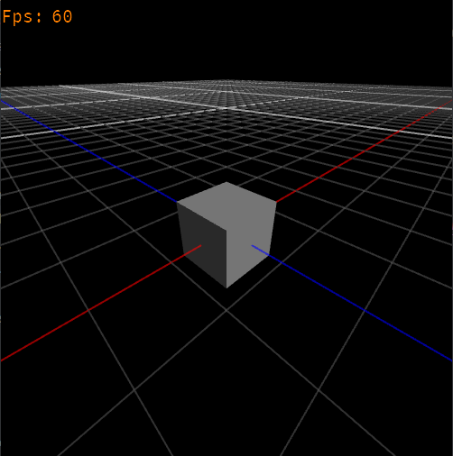
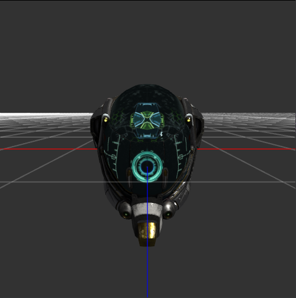
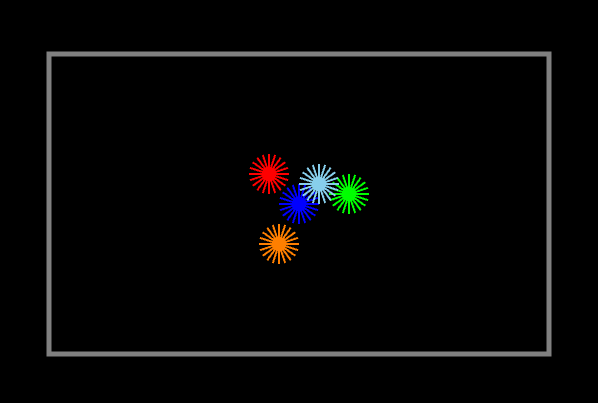
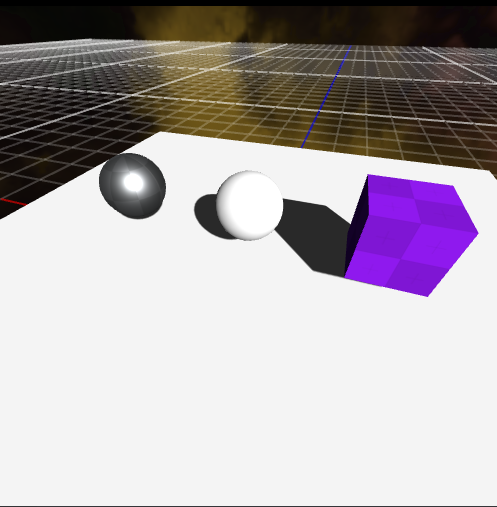
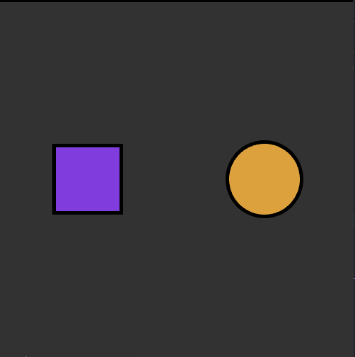
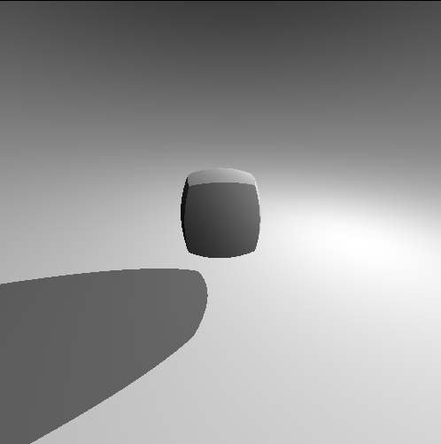
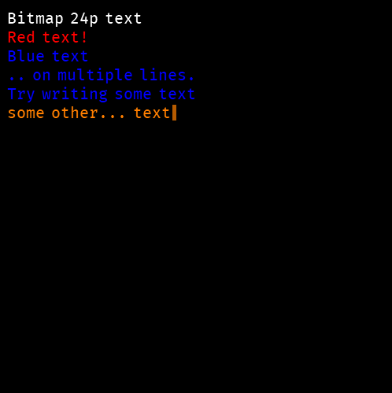
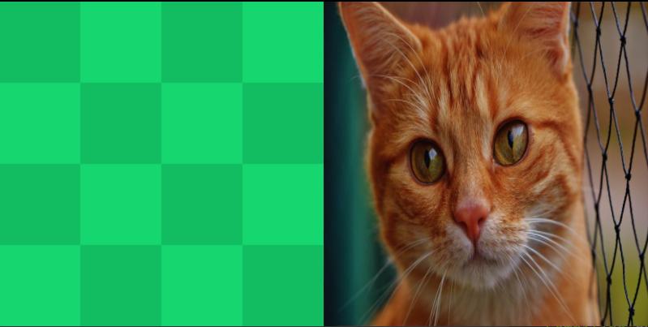

<h1 align="center">Examples</h1>

<div align="center">
  <strong>Duku usage examples</strong>
</div>

<br />

These examples use these CC0-licensed assets:

- [Kenney Assets]
- [glTF Sample Models]

---

To run these examples use:

```bash
cargo run --example [example-name] --features="[features]"
```

Required features are listed on this page by each example name.

---

[canvas](https://github.com/oberzs/duku/tree/release/examples/canvas.rs) - `window`
<br>


---

[gltf](https://github.com/oberzs/duku/tree/release/examples/gltf.rs) - `window` `gltf`
<br>


---

[hello](https://github.com/oberzs/duku/tree/release/examples/hello.rs) - `window`
<br>


---

[lines](https://github.com/oberzs/duku/tree/release/examples/lines.rs) - `window`
<br>


---

[materials](https://github.com/oberzs/duku/tree/release/examples/materials.rs) - `window` `png`
<br>


---

[shapes](https://github.com/oberzs/duku/tree/release/examples/shapes.rs) - `window`
<br>


---

[surface](https://github.com/oberzs/duku/tree/release/examples/surface.rs) - `window` `glsl`
<br>


---

[text](https://github.com/oberzs/duku/tree/release/examples/text.rs) - `window`
<br>


---

[textures](https://github.com/oberzs/duku/tree/release/examples/textures.rs) - `window` `png` `jpeg`
<br>


[kenney assets]: https://www.kenney.nl/assets
[gltf sample models]: https://github.com/KhronosGroup/glTF-Sample-Models
