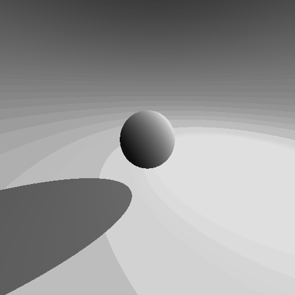
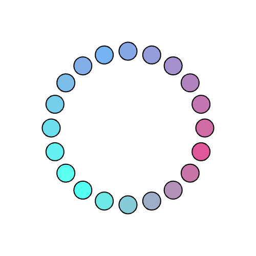

# Examples

[Running](#running) • [3D Examples](#3d-examples) • [2D Examples](#2d-examples)

Duku usage examples. Examples use the [Kenney Assets] and [Font Awesome].

## Running

To run these examples use:

```bash
cargo run --example [example_name] --features="[features]"
```

Required features are listed on this page by each example name.

## 3D Examples

[rotating_cube](3d-examples/rotating_cube.rs) - `window`
<br>


---

[raymarch](3d-examples/raymarch.rs) - `window` `glsl`
<br>


---

[ship_model](3d-examples/ship_model.rs) - `window` `gltf`
<br>


## 2D Examples

[textbox](2d-examples/textbox.rs) - `window` `otf`
<br>


---

[run_animation](2d-examples/run_animation.rs) - `window` `png`
<br>


---

[gradient](2d-examples/gradient.rs) - `window`
<br>


[kenney assets]: https://www.kenney.nl/assets
[font awesome]: https://fontawesome.com/
